# Contract Map

Contract Map reconstructs how one EVM contract behaves and interacts with the rest of the chain.

Given an address, it identifies the contract and its exposed functions, traces internal execution, maps outbound calls by function, and reconstructs which contracts and functions call into it.

It combines Solidity, Vyper, bytecode analysis, verified source, ABI data, and historical transaction traces. Static analysis shows what execution paths are possible. Runtime traces show what was actually observed.

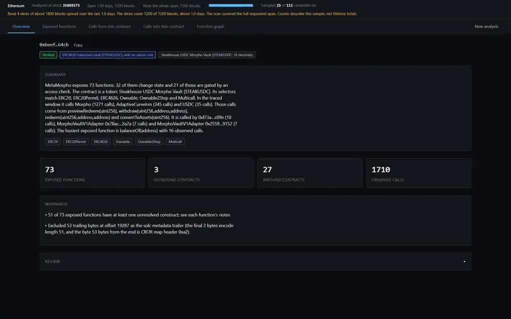

## What it shows

Paste one contract address and select a chain.

Contract Map returns:

* the contract type, implementation and callable surface
* what each exposed function does
* internal functions reached from each entry point
* contracts and functions called by the target
* contracts and functions that call into the target
* observed call counts for the scanned execution sample

The tool maps execution. It is not a block explorer or security scanner.

## Execution model

Every function is reduced to the same path:

```text
External caller
      ↓
Target function
      ↓
Internal execution
      ↓
External contract
      ↓
External function
```

For example:

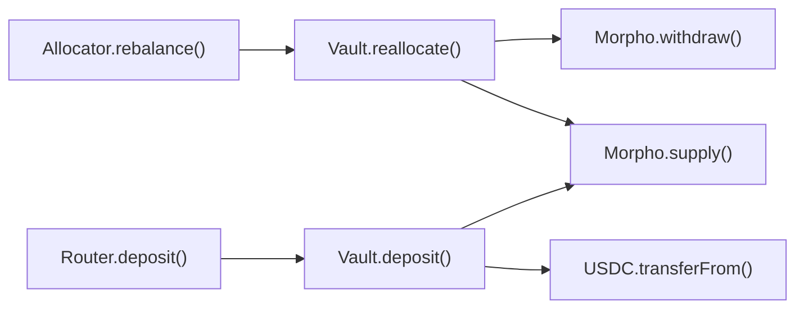

The corresponding execution tree can look like:

```text
deposit(uint256,address)   selector 0x6e553f65
├── _deposit() → super._deposit() → SafeERC20.safeTransferFrom()
│                                   └── USDC.transferFrom()      [3 observed]
└── _supplyMorpho()
    ├── MorphoLib.supplyShares() → Morpho.extSloads()            [39 observed]
    ├── Morpho.market()                                          [39 observed]
    ├── Morpho.accrueInterest()                                  [3 observed]
    └── Morpho.supply()                                          [3 observed]
```

This exposes both the source-level execution path and the external calls that were actually observed onchain.

## Interface

<table>
<tr>
<td width="50%">

**Entry**

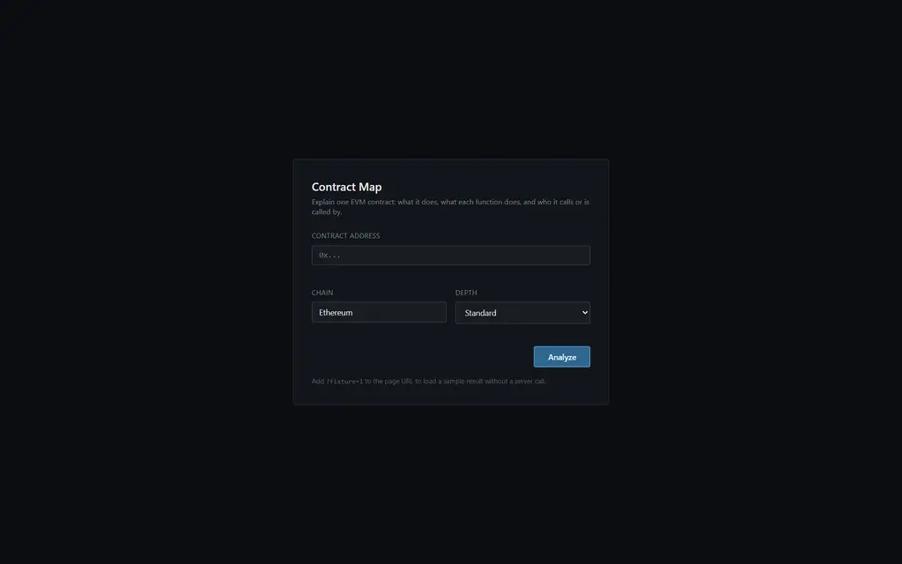

</td>
<td width="50%">

**Analysis progress**

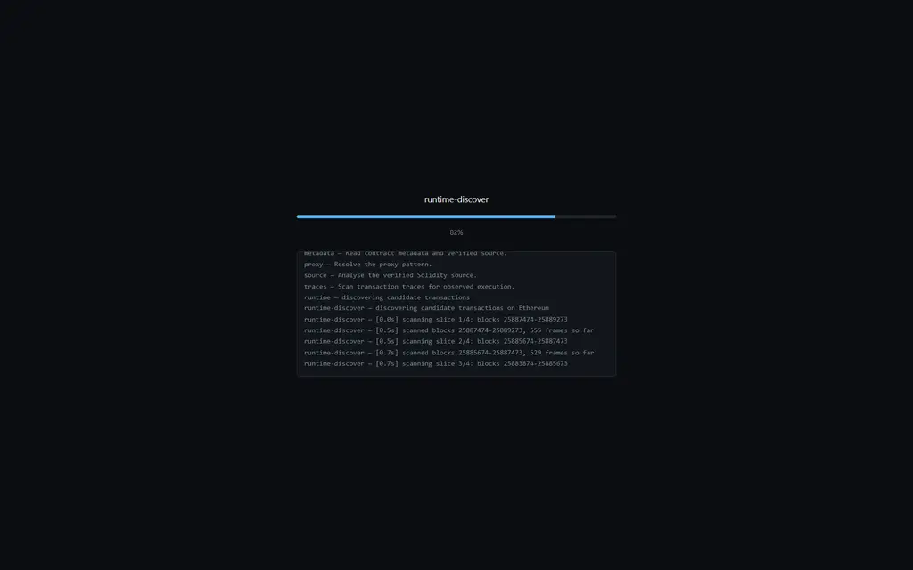

</td>
</tr>
<tr>
<td width="50%">

**Exposed functions**

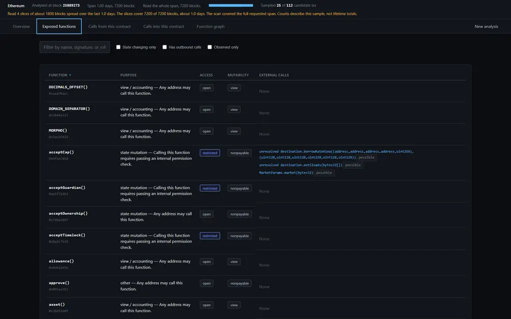

</td>
<td width="50%">

**Function detail**

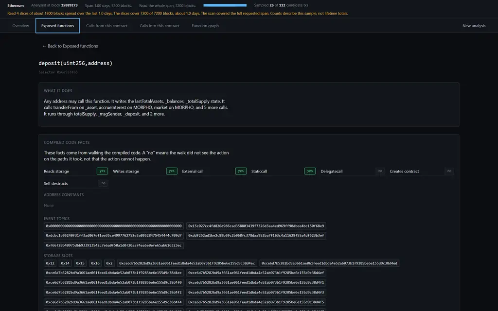

</td>
</tr>
<tr>
<td width="50%">

**Outbound calls**

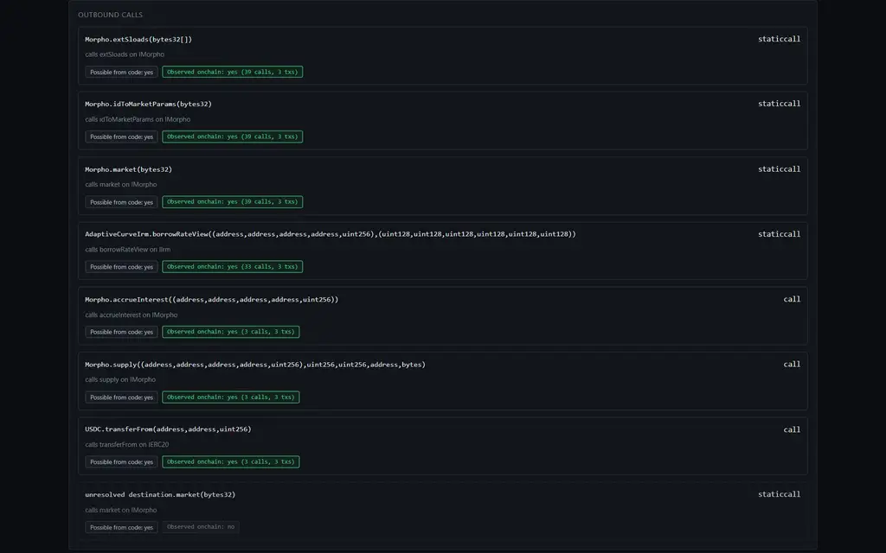

</td>
<td width="50%">

**Observed calls from the target**

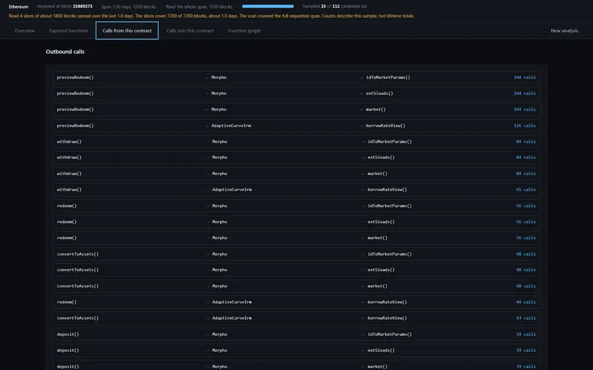

</td>
</tr>
<tr>
<td width="50%">

**Observed calls into the target**

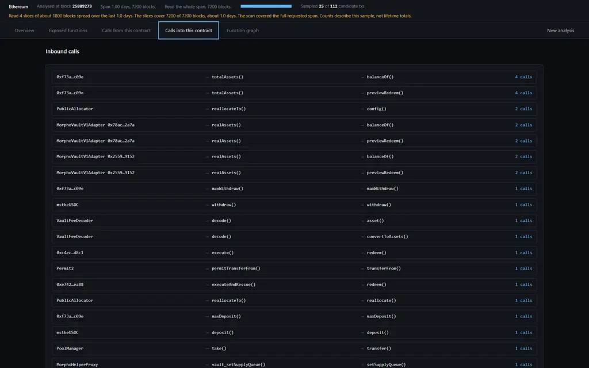

</td>
<td width="50%">

**Function graph**

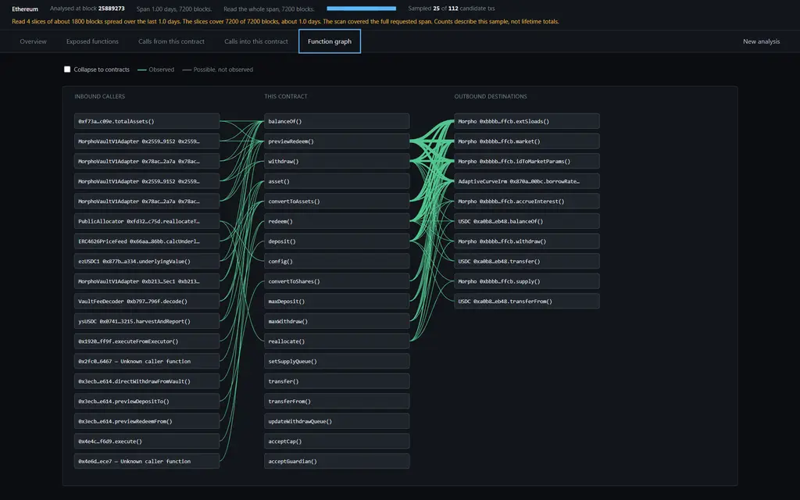

</td>
</tr>
</table>

The graph defaults to function-level edges. Contract-level aggregation is available when a higher-level view is more useful.

## Evidence model

Contract Map keeps three types of calls separate.

```text
Internal   deposit() → _convertToShares()
Outbound   deposit() → USDC.transferFrom()
Inbound    Router.deposit() → Vault.deposit()
```

Internal calls remain inside the analysed implementation. Outbound calls leave it. Inbound calls originate from another contract.

Static and runtime evidence are also kept separate.

```text
deposit() → Morpho.supply()

Possible from code : yes
Observed onchain   : yes, 3 calls
```

A call path found in source or bytecode is reported as possible execution. It becomes observed execution only when the corresponding path appears in transaction traces.

Unobserved paths are never counted as executed.

### Clickable proof on every observed row

Each observed edge carries the transactions it was derived from, so no count has to be taken on trust. The interface links them to a block explorer on every row: inbound, outbound, contract roll-ups, delegatecalls and observed execution.

```text
deposit(uint256,address) → Morpho.supply(...)
  proof  0xd78154bf…c871f   block 25889440   frame path 1,2,0
```

A row that is possible from code but not observed carries no link, because nothing proves it.

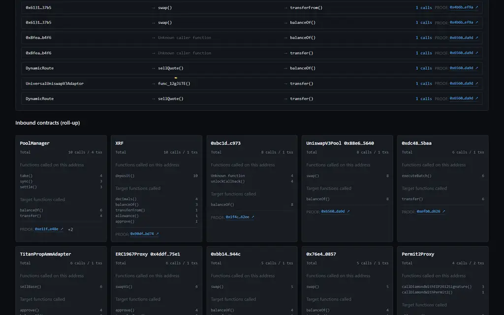

Every inbound row and every roll-up card ends with a `PROOF` link. The link opens the transaction on the block explorer of that chain. USDC on Ethereum is the example here.

<table>
<tr>
<td width="50%">

**More than one proof transaction**

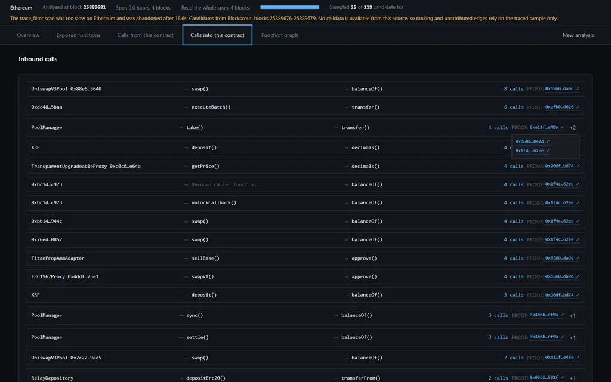

</td>
<td width="50%">

**Proof on observed execution**

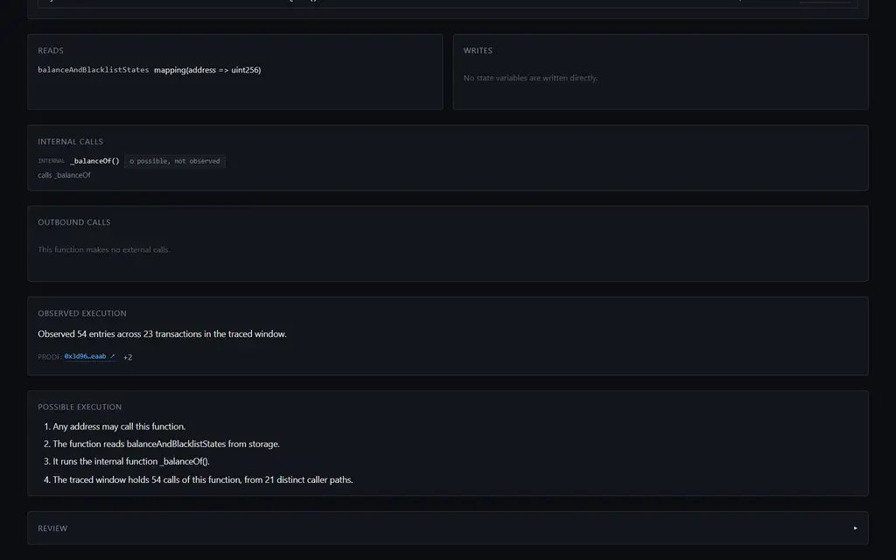

</td>
</tr>
</table>

A row shows the newest transaction first. The `+N` button opens the other transactions for the same edge. A chain with no known explorer shows the raw hash and a copy control instead of a dead link.

Explain any transaction from the terminal, with the same walk the application uses:

```bash
bun run scripts/explain-tx.ts <txHash> <targetAddress> ethereum
```

[`docs/EXAMPLE-TRANSACTION.md`](docs/EXAMPLE-TRANSACTION.md) follows one real transaction end to end, with the full 232 frame trace committed next to it.

## Quick start

Requirements: [Bun](https://bun.sh) 1.2 or later, git, and an RPC endpoint of your own, from any provider. No Node.js, no database and no wallet are needed. The tool only reads chain data, so it never asks for a private key or a signature.

### 1. Get the code

```bash
git clone https://github.com/linstan1/contract-map.git
cd contract-map
bun install
```

`bun install` fetches two development packages only: `@types/bun` and `typescript`. The application itself has no runtime dependency.

### 2. Configure your own endpoint

The repository ships no key, no URL and no default, so this step is required. Pick one of the two ways.

**Any provider, by URL.** Set `RPC_URL` to the full JSON-RPC URL. It serves every chain.

```bash
cp .env.example .env.local
# open .env.local and set RPC_URL=https://your-provider.example/your-path
```

One chain at a time uses `RPC_URL_` plus the chain key in capitals, for example `RPC_URL_ETHEREUM`, `RPC_URL_BASE` or `RPC_URL_ARBITRUM`. A per-chain value wins over `RPC_URL`. Mix the two freely: one URL for the chain you care about, and `RPC_URL` or an Alchemy key for the rest.

**An Alchemy key.** Set `ALCHEMY_API_KEY` instead, and the code builds the Alchemy URL for each chain from `src/chains.ts`.

```bash
# in .env.local
ALCHEMY_API_KEY=<your key>
```

On Linux or macOS, restrict the file to your user:

```bash
chmod 600 .env.local
```

An environment variable works instead of the file, and takes precedence:

```bash
export RPC_URL=https://your-provider.example/your-path
```

A non-interactive setup, for a script or an agent:

```bash
git clone https://github.com/linstan1/contract-map.git && cd contract-map
bun install
printf 'RPC_URL=%s\n' "$RPC_URL" > .env.local && chmod 600 .env.local
bun run check-secrets && bunx tsc --noEmit && bun test
bun run server.ts
```

#### What your provider must answer

| Part of the analysis | Methods needed |
|---|---|
| Static half: bytecode, source, proxy resolution, possible call paths | `eth_blockNumber`, `eth_getCode`, `eth_getStorageAt`, `eth_call` |
| Observed half: inbound and outbound edges, counts, proof links | `trace_filter` plus `trace_transaction`, or `debug_traceTransaction` with the `callTracer` |

Every provider answers the first row. The second row needs the `trace` namespace or the `debug` namespace, and an archive plan deep enough for the span your depth setting asks for.

The code adapts to what your endpoint really answers. A provider that refuses `trace_filter` switches to Blockscout candidate discovery at once. A provider that refuses `trace_transaction` expands the candidates with `debug_traceTransaction` instead. Each switch is stated in the window note and in the review, so a smaller answer never looks like a complete one.

Run `bun run probe-chains` to measure your own provider. The chain table in `src/chains.ts` describes Alchemy, and a different provider gives different answers.

### 3. Check the setup before you use it

```bash
bun run check-secrets   # No credential found in 94 tracked files.
bunx tsc --noEmit       # no output
bun test                # 80 pass, 1 skip, 0 fail
```

These three commands need no key and no network. They confirm the checkout is intact and carries no credential.

### 4. Run one analysis in the terminal

```bash
bun run scripts/smoke.ts 0xBEEF01735c132Ada46AA9aA4c54623cAA92A64CB ethereum quick
```

This is the fastest way to confirm the key works. Expect progress lines on stderr, then a report on stdout that starts with the contract label, the likely type and the proxy state. A missing or rejected key stops the run immediately with instructions.

### 5. Start the interface

```bash
bun run server.ts
```

```text
Contract execution explorer on http://127.0.0.1:8787
Authentication is off. The socket is on the loopback address only.
```

Open <http://localhost:8787>, paste an address, choose a chain and a depth, then run the analysis.

To inspect the interface without a key and without network access:

```text
http://localhost:8787/?fixture=1
```

Re-test trace support across the configured chains, which spends your own quota:

```bash
bun run scripts/probe-chains.ts
```

### Secure by default, and how to keep it that way

| Property | Default | What to do |
| --- | --- | --- |
| Network exposure | binds `127.0.0.1` only | leave `HOST` unset for local use |
| Remote access | refused | set `HOST` **and** `AUTH_TOKEN` together; the server exits if `HOST` is public without a token |
| API authentication | off on loopback | `AUTH_TOKEN=$(openssl rand -hex 32)`, then send `X-Auth-Token` |
| Credential exposure to the browser | none | nothing to do; the page calls only `/api/*` on your own host |
| Credential in error output | scrubbed | nothing to do; `src/rpc.ts` replaces the key, the whole URL and each credential inside it with `***` |
| Credential in version control | ignored | run `bun run check-secrets` before you push a fork |
| Third-party assets | none | nothing to do; no CDN, no font and no analytics are loaded |
| Signing keys | never used | the tool reads chain state only, so no wallet is involved |

Two habits worth adopting at the provider: restrict the credential to your own machine or domain in the provider dashboard, and set a request cap. This tool spends requests in proportion to the depth you choose.

To expose the interface beyond your machine:

```bash
AUTH_TOKEN=$(openssl rand -hex 32) HOST=0.0.0.0 bun run server.ts
```

The page then asks for the token once and keeps it in `localStorage`. Without `AUTH_TOKEN`, the same command refuses to start rather than serve an open endpoint that spends your own request budget.

### If something fails

| Symptom | Cause and fix |
| --- | --- |
| `No RPC endpoint is configured, and this project ships none.` | Step 2 is missing or the value is a placeholder. Set `RPC_URL`, `RPC_URL_<CHAIN>` or `ALCHEMY_API_KEY`. |
| `This endpoint does not answer trace_filter` | Your provider has no `trace` namespace or no archive plan. The run continues on the Blockscout path with a smaller window. |
| `The endpoint refuses trace_transaction` | Expected on some providers. The run expands the candidates with `debug_traceTransaction` instead. |
| `holds no code on <chain>` | The address is an account, not a contract, or it is on another chain. |
| `is not a 20 byte address` | The input is not `0x` plus 40 hex characters. |
| The explorer refused, source view is thin | Blockscout answered HTTP 429. Wait, then run again. The review panel names the refusal. |
| A tiny window on a busy chain | Expected. The strip states the span, the coverage and the stop reason. Raise the depth. |
| `EADDRINUSE` | Another process holds the port. Use `PORT=8788 bun run server.ts`. |
| Few labels, many short addresses | The label budget or the explorer limited it. The review panel says which. |

## How it works

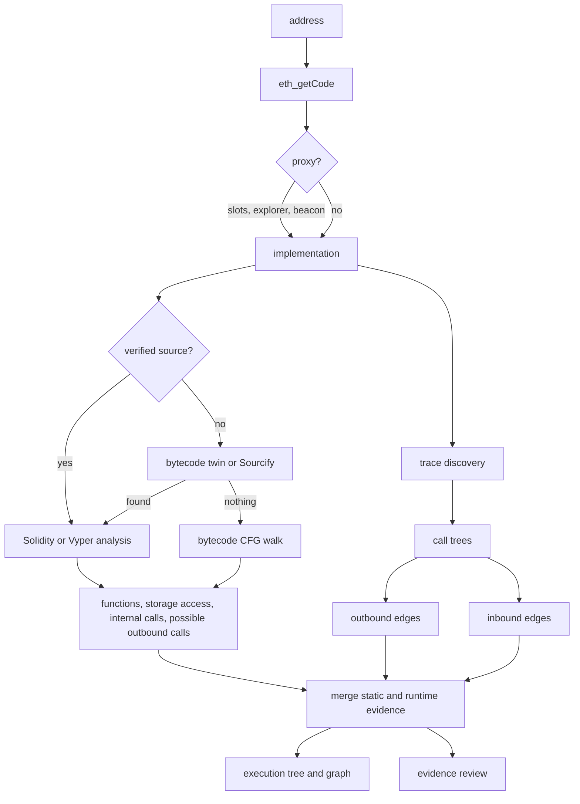

| Stage             | Module                  | Output                                                                                             |
| ----------------- | ----------------------- | -------------------------------------------------------------------------------------------------- |
| Solidity analysis | `src/solidity/*`        | proxy state, ABI surface, selectors, storage access, internal calls and possible outbound calls    |
| Vyper analysis    | `src/vyper/*`           | equivalent analysis for Vyper, including `extcall`, `staticcall`, `raw_call` and generated getters |
| Bytecode analysis | `src/bytecode/*`        | storage reads and writes, calls, delegatecalls, constants and event topics                         |
| Source recovery   | `src/sourcerecovery.ts` | source recovered from Sourcify or a verified bytecode twin                                         |
| Runtime analysis  | `src/runtime/*`         | call discovery, call trees and observed inbound and outbound edges                                 |
| Pipeline          | `src/pipeline.ts`       | merged static and runtime evidence                                                                 |
| Review            | `src/review.ts`         | evidence boundaries and unresolved analysis                                                        |

## Data sources

| Source                                     | Use                                                                    |
| ------------------------------------------ | ---------------------------------------------------------------------- |
| Your JSON-RPC endpoint, from any provider  | bytecode, storage and traces                                           |
| `trace_filter` and `trace_transaction`     | trace discovery on supported chains                                    |
| `debug_traceTransaction` with `callTracer` | transaction-level call trees                                           |
| Blockscout v2                              | verified source, ABI, proxy implementations, token metadata and labels |
| Sourcify and verified bytecode twins       | source recovery                                                        |
| OpenChain and 4byte                        | unresolved selector signatures                                         |

Signatures returned by external databases are re-hashed and checked against the selector before being accepted.

## Chains

The repository currently contains 19 live-probed chain configurations.

| Trace path                                       | Chains                                                                                                                |
| ------------------------------------------------ | --------------------------------------------------------------------------------------------------------------------- |
| `trace_filter` + `trace_transaction`             | Ethereum, Base, Optimism, Gnosis, Celo, Linea, Unichain, Ink, Soneium, Worldchain, BNB, Berachain, Sonic, Ronin, Zora |
| Blockscout candidates + `debug_traceTransaction` | Arbitrum One, Polygon, zkSync, Scroll                                                                                 |

Chain support and exclusions are defined in `src/chains.ts`. That table was probed against Alchemy, so it states the first choice per chain, not a fixed rule. The code follows the endpoint you configure: it moves to Blockscout candidates when your provider refuses `trace_filter`, and to `debug_traceTransaction` when it refuses `trace_transaction`. Run `bun run probe-chains` to measure your own provider.

## Scan depth

Depth controls the historical time span and tracing budget.

| Depth    |    Span | Slices | Transactions | Frame cap | Stage ceiling |
| -------- | ------: | -----: | -----------: | --------: | ------------: |
| quick    |   1 day |      4 |           25 |     4,000 |          60 s |
| standard |  7 days |     10 |           80 |    12,000 |         120 s |
| deep     | 45 days |     24 |          220 |    30,000 |         240 s |

When the full period cannot be scanned within the budget, Contract Map samples slices distributed across the requested span.

The interface reports the requested span, actual block coverage, approximate time coverage and stop reason.

Observed counts therefore describe the scanned sample, not lifetime contract activity.

## Evidence constraints

An inbound or outbound edge requires a direct parent-child relationship in the reconstructed call tree. Two contracts appearing in the same transaction do not create an edge.

Proxy and implementation execution are treated as one contract identity where execution occurs through delegatecall. Delegatecalls leaving that identity remain separate from ordinary external calls.

The ABI defines the exposed callable surface when one is available. Source functions that do not correspond to that surface are excluded and reported.

Recovered source is labelled by origin and accepted only after its dispatcher selectors sufficiently match the analysed bytecode.

Bytecode analysis reports only paths reached by the control-flow walk. Dynamic jumps that terminate analysis are surfaced in the evidence review.

Observed counts are never extrapolated beyond the scanned sample.

Selectors and caller functions that cannot be resolved remain unresolved rather than receiving inferred names.

## Security

The server binds to `127.0.0.1` by default.

If `HOST` exposes the service externally, the server requires `AUTH_TOKEN`.

API routes support authentication through `X-Auth-Token` or a token query parameter.

RPC credentials remain server-side and are scrubbed from propagated RPC errors, because a failed request otherwise carries the endpoint URL. `src/config.ts` builds the scrub list from the Alchemy key, the whole custom URL, each long path segment, each long query value and the userinfo password. The browser never receives any of them.

No credential is committed and none is distributed. `.env.local` and every `.env.*` variant are ignored by git, `scripts/check-secrets.ts` fails the build on any credential shape in a tracked file, including a populated `RPC_URL`, and CI runs that scan before the type check and the tests. A fork therefore starts with no credential and must configure its own.

## Verification

```bash
bun test
bunx tsc --noEmit
```

Current suite:

```text
62 tests
349 assertions
```

Tests cover selector hashing and validation, proxy-aware trace aggregation, nested calls, EOA callers, false same-transaction edges, Solidity type canonicalisation, cross-file resolution, bytecode dispatcher patterns, static and dynamic jumps, metadata handling, and Vyper 0.3/0.4 constructs.

Live checks have also been run against several mainnet contracts.

| Target                            | Result                                                                               |
| --------------------------------- | ------------------------------------------------------------------------------------ |
| MetaMorpho `0xBEEF…64CB`          | 73 exposed functions, 3 outbound contracts and 27 inbound contracts                  |
| Curve 3pool `0xbEbc…F1C7`         | 38/38 ABI functions resolved with storage and transfer execution                     |
| USDC implementation `0x4350…02dd` | bytecode analysis distinguishes state-changing `transfer` from read-only `balanceOf` |
| Permit2 `0x0000…8BA3`             | 15/15 dispatcher selectors resolved                                                  |
| ARB `0x912C…6548`                 | inbound execution reconstructed through the Arbitrum trace path                      |

## Project structure

```text
contract-map/
├── server.ts
├── src/
│   ├── types.ts
│   ├── chains.ts
│   ├── config.ts
│   ├── keccak.ts
│   ├── abi.ts
│   ├── rpc.ts
│   ├── blockscout.ts
│   ├── signatures.ts
│   ├── labels.ts
│   ├── sourcerecovery.ts
│   ├── solidity/
│   ├── vyper/
│   ├── bytecode/
│   ├── runtime/
│   ├── pipeline.ts
│   └── review.ts
├── public/
├── scripts/
└── docs/
```

## Documentation

[`docs/CONCEPTS.md`](docs/CONCEPTS.md) covers trace trees, `trace_filter`, `debug_traceTransaction`, proxy execution, selector resolution, bytecode dispatchers and execution sampling.

[`docs/ARCHITECTURE.md`](docs/ARCHITECTURE.md) covers module boundaries, pipeline invariants and extension points for chains, source languages and dispatcher patterns.

[`docs/EXAMPLE-TRANSACTION.md`](docs/EXAMPLE-TRANSACTION.md) follows one real mainnet transaction from the raw trace to the inbound and outbound edges the interface shows, and explains what a proof link does and does not prove.

## Limits

Contract Map is not an audit tool. Its Solidity and Vyper analysers are custom parsers rather than full compilers, and unresolved constructs are reported rather than inferred.

Runtime counts depend on the transactions and blocks scanned. They should be read as sample statistics.

Repeated analyses currently re-fetch upstream data because there is no persistent result cache.

Huff and assembly-heavy contracts rely primarily on bytecode and runtime evidence.

The server is designed as a local single-user tool and does not provide queueing or multi-tenant execution.

## Contributing

Changes should preserve three invariants.

Never infer a name, signature, edge or count that cannot be supported by evidence.

Keep possible execution separate from observed execution.

Add tests for errors that would otherwise produce plausible but incorrect output.

MIT licensed.
