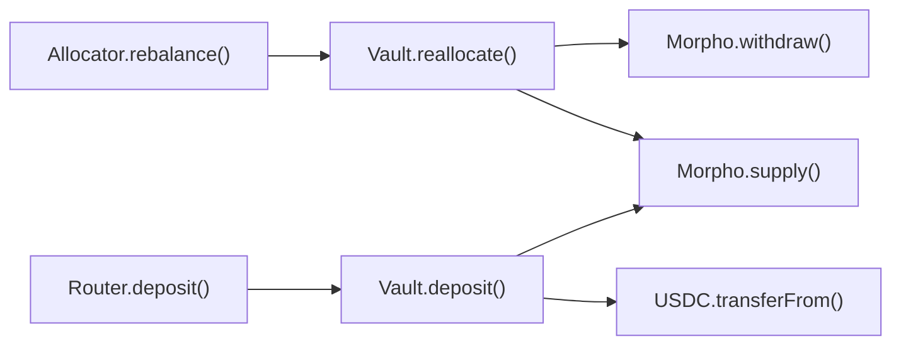
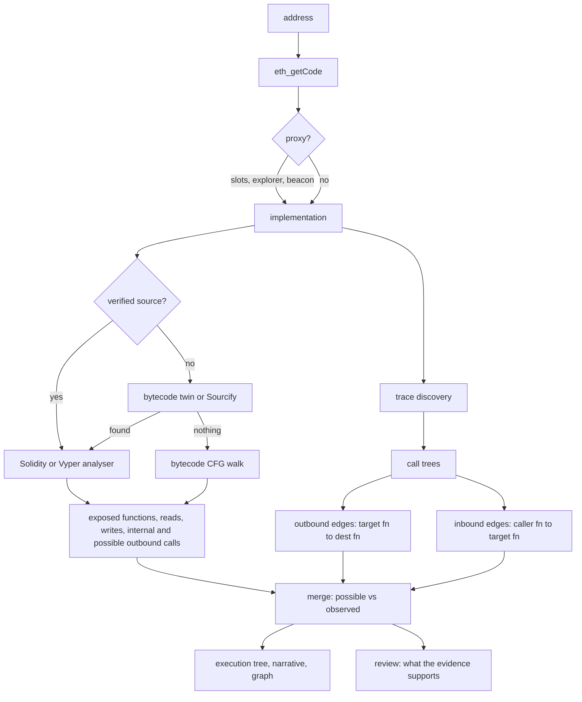

<div align="center">

# 🗺️ Contract Map

### An execution-oriented map of one EVM contract

**What is this contract? What does each function do? Who does it call? Who calls it?**

[](https://bun.sh)
[](https://www.typescriptlang.org/)
[](#-project-layout)
[](#-verification)
[](#-chains)
[](LICENSE)


</div>

---

## 📖 Table of contents

| | | |
|---|---|---|
| [🎯 What it answers](#-what-it-answers) | [🧠 The mental model](#-the-mental-model) | [📸 The screens](#-the-screens) |
| [📚 The six words](#-the-six-words) | [⚖️ The two rules](#️-the-two-rules-that-make-it-trustworthy) | [🚀 Quick start](#-quick-start) |
| [🔬 How it works](#-how-it-works) | [🕸️ Chains](#️-chains) | [🎚️ Depth](#️-depth-settings) |
| [🛡️ Honesty rules](#️-honesty-rules-the-code-enforces) | [🔐 Security](#-security) | [🧪 Verification](#-verification) |
| [🗂️ Project layout](#️-project-layout) | [🎓 Learn the techniques](#-learn-the-techniques) | [⚠️ Limits](#️-limits) |

---

## 🎯 What it answers

You paste one address. The tool answers four questions, and nothing else.

```text
Contract address
[ 0x________________________________ ]          [ Analyze ]
```

| | Question | Where the answer comes from |
|---|---|---|
| 1️⃣ | **What is this contract?** | proxy resolution, ABI, matched standards, verified source |
| 2️⃣ | **What does each exposed function do?** | source analysis, plus a walk of the compiled code |
| 3️⃣ | **Which contracts and functions does it call?** | call sites in code, plus real transaction traces |
| 4️⃣ | **Which contracts and functions call into it?** | real transaction traces only |

It is **not** a block explorer. It is **not** a security scanner. It maps execution.

---

## 🧠 The mental model

Every view in the tool follows one chain of thought.

```text
External caller
      ↓
Target function
      ↓
Internal logic
      ↓
External contract
      ↓
External function
```

A real example, taken from a live analysis of a Morpho vault:



And the same idea as the tool prints it, with real observed counts:

```text
deposit(uint256,address)   selector 0x6e553f65
├── _deposit() → super._deposit() → SafeERC20.safeTransferFrom()
│                                   └── USDC.transferFrom()      [3 observed]
└── _supplyMorpho()
    ├── MorphoLib.supplyShares() → Morpho.extSloads()            [39 observed]
    ├── Morpho.market()                                          [39 observed]
    ├── Morpho.accrueInterest()                                  [3 observed]
    └── Morpho.supply()                                          [3 observed]
```

Read that tree once and you know what `deposit` really does: it pulls USDC from the
caller through a library wrapper, then supplies it into Morpho.

---

## 📸 The screens

<table>
<tr>
<td width="50%">

**1. One input, nothing else**


</td>
<td width="50%">

**2. Honest progress, not a spinner**


</td>
</tr>
<tr>
<td width="50%">

**3. Exposed functions, with purpose and access**


</td>
<td width="50%">

**4. Function detail: compiled code facts**


</td>
</tr>
<tr>
<td width="50%">

**5. Every outbound call, labelled twice**


</td>
<td width="50%">

**6. Calls from this contract, ranked**


</td>
</tr>
<tr>
<td width="50%">

**7. Calls into this contract, ranked**


</td>
<td width="50%">

**8. A graph of functions, not of boxes**


</td>
</tr>
</table>

The graph is **function level** on purpose. `Allocator → Vault → Morpho` teaches you
nothing. `Allocator.rebalance() → Vault.reallocate() → Morpho.withdraw()` teaches you
the path. One toggle collapses it to contracts when you want the overview.

---

## 📚 The six words

The interface uses these six categories and never invents another one.

| | Term | Meaning |
|---|---|---|
| 🚪 | **Exposed functions** | Functions another address can call on the target. |
| 🔁 | **Internal calls** | Functions inside the target implementation that other target functions call. |
| 📤 | **Outbound calls** | Calls the target makes into another contract. |
| 📥 | **Inbound calls** | Calls another contract makes into the target. |
| 👁️ | **Observed execution** | Calls seen in historical transaction traces. |
| 🧩 | **Possible execution** | Calls found in code, but not always seen on chain. |

---

## ⚖️ The two rules that make it trustworthy

### Rule 1: three kinds of call never merge

Most tools blur these together and produce a number that means nothing. Here they live
in separate fields, separate views, and separate counters.

```text
Internal   deposit() → _convertToShares()      inside the target
Outbound   deposit() → USDC.transferFrom()     target calls out
Inbound    Router.deposit() → Vault.deposit()  someone calls in
```

### Rule 2: possible and observed are different facts

A Solidity function can be **able** to call something that never actually happened in
the window you scanned. Saying otherwise is a lie about the chain.

```text
deposit()  →  Morpho.supply()
Possible from code : yes
Observed onchain   : yes  (3 calls in 3 transactions)

emergencyWithdraw()  →  Morpho.withdraw()
Possible from code : yes
Observed onchain   : no          ← never dressed up as executed
```

The UI renders an unobserved path with a dashed border and a grey badge, so you cannot
confuse the two at a glance.

---

## 🚀 Quick start

```bash
git clone https://github.com/<you>/contract-map.git
cd contract-map
bun install                       # only @types/bun and typescript
cp .env.example .env.local        # then paste your RPC key
bun run server.ts                 # http://localhost:8787
```

You need one key, from any [Alchemy](https://alchemy.com) account:

```text
ALCHEMY_API_KEY=your_key_here
```

Run one analysis in the terminal instead of the browser:

```bash
bun run scripts/smoke.ts 0xBEEF01735c132Ada46AA9aA4c54623cAA92A64CB ethereum quick
```

Explore the interface with no key and no network:

```text
http://localhost:8787/?fixture=1
```

Re-probe every chain for trace support:

```bash
bun run scripts/probe-chains.ts
```

---

## 🔬 How it works



| Stage | Module | Output |
|---|---|---|
| 🏗️ Contract structure, Solidity | `src/solidity/*` | proxy, ABI, selectors, per-function reads, writes, internal calls, possible outbound calls |
| 🐍 Contract structure, Vyper | `src/vyper/*` | the same, with indentation scoped rules, `extcall`, `staticcall`, `raw_call`, generated getters |
| ⚙️ Compiled code | `src/bytecode/*` | per-function storage reads and writes, calls out, delegatecalls, address constants, event topics |
| 🧷 Source recovery | `src/sourcerecovery.ts` | source from a verified bytecode twin or from Sourcify, when the address has none |
| 🗺️ Execution map | `src/pipeline.ts` | one execution tree and one plain-English account per function |
| 📤 Outbound runtime | `src/runtime/*` | target function → destination contract → destination function, with call counts |
| 📥 Inbound runtime | `src/runtime/*` | caller contract → caller function → target function, with call counts |
| 🔎 Review | `src/review.ts` | what the evidence supports, and exactly where it stops |

### Data sources

| Source | Used for |
|---|---|
| Alchemy JSON-RPC | code, storage slots, traces |
| `trace_filter` + `trace_transaction` | wide trace discovery where the provider serves them |
| `debug_traceTransaction` + `callTracer` | trace trees everywhere else |
| Blockscout v2 | verified source, ABI, proxy implementations, token metadata, names, ENS |
| Sourcify + verified bytecode twin | source for an address that has none of its own |
| openchain + 4byte | selector names that no ABI explains |

Every signature from a database is **re-hashed and compared to the selector** before it
is trusted, so no name in the output is a guess.

---

## 🕸️ Chains

19 chains, each added only after a live probe. `scripts/probe-chains.ts` re-runs it.

| Chain | `trace_filter` | Discovery path |
|---|---|---|
| Ethereum, Base, Optimism, Gnosis, Celo, Linea, Unichain, Ink, Soneium, Worldchain, BNB, Berachain, Sonic, Ronin, Zora | ✅ | `trace_filter` + `trace_transaction` |
| Arbitrum One, Polygon, zkSync, Scroll | ❌ | Blockscout candidates + `debug_traceTransaction` |

The rule for inclusion is written in `src/chains.ts`, together with **every excluded
chain and the reason**. A missing chain is a recorded fact, not an oversight.

---

## 🎚️ Depth settings

Depth asks for a span of **time**, not a block count, so a chain with two second blocks
and a chain with twelve second blocks answer the same question.

| Depth | Span | Slices | Transactions traced | Frame cap | Stage ceiling |
|---|---|---|---|---|---|
| ⚡ quick | 1 day | 4 | 25 | 4,000 | 60 s |
| 🚶 standard | 7 days | 10 | 80 | 12,000 | 120 s |
| 🏊 deep | 45 days | 24 | 220 | 30,000 | 240 s |

A dense chain cannot read a whole span inside the ceiling. The scan then reads slices
spread **evenly across the span**, instead of one recent range that only describes the
last few minutes:

```text
Read 4 slices of about 333 blocks spread over the last 1.0 days.
The slices cover 1332 of 43200 blocks, about 44 minutes.
The frame cap for depth "quick" stopped the scan.
Counts describe this sample, not lifetime totals.
```

That sentence sits in the provenance strip on every screen. You can never mistake a
sampled count for a lifetime total.

---

## 🛡️ Honesty rules the code enforces

- 🔗 **An edge needs a real call path.** Two contracts in one transaction never produce
  an edge. Only a direct parent and child relation in a call tree does.
- 🎭 **Proxy and implementation are one identity**, so a delegatecall never breaks a
  path. A delegatecall out of that identity is listed apart from ordinary calls.
- 📜 **The ABI is ground truth** for the callable surface. A source function whose
  selector is absent from the ABI is dropped and reported, never shown.
- 🧷 **Recovered source names its origin**, and it is accepted only when two thirds of
  the dispatcher selectors of the analysed code appear in that ABI.
- ⚙️ **A compiled fact of `no` means "not seen on the walked paths"**, and the review
  reports every walk that stopped early at a dynamic jump.
- 🔢 **No count is extrapolated.** The strip states the span, the covered part, and the
  stop reason.
- ❓ **Nothing is invented.** An unresolved selector prints as raw four bytes. An
  unresolved caller function prints `Unknown caller function`.
- 🏷️ **A missing label says why**: the lookup budget ended, or the explorer refused.

---

## 🔐 Security

| | Control |
|---|---|
| 🕳️ | The socket binds `127.0.0.1`. Set `HOST` to change that, and the server then **refuses to start** without `AUTH_TOKEN`. |
| 🔑 | `AUTH_TOKEN`, when set, gates every `/api/` route through the `X-Auth-Token` header or a `token` query parameter. |
| 🧹 | The RPC key never leaves the server, and `src/rpc.ts` scrubs it from every error message, because a failed request otherwise carries the endpoint URL. |
| 🙈 | `.gitignore` covers `.env.local`. The browser never sees the key. |
| 💾 | The page stores an access token in `localStorage` and never puts it in the address bar. |

---

## 🧪 Verification

```bash
bun test          # 62 tests, 349 assertions
bunx tsc --noEmit # strict, noUncheckedIndexedAccess
```

The suite covers the parts where a mistake would be invisible in the output:

- ✅ keccak256 against published vectors, plus a multi-block message from an independent
  implementation, because a wrong hash means every selector is wrong.
- ✅ Selector verification: a signature database answer that does not re-hash to the
  requested selector is rejected. A real 4-byte collision is included.
- ✅ Trace aggregation over hand-built call trees: proxy delegatecall context, nested
  attribution, an EOA caller, and a same-transaction pair that must produce **no** edge.
- ✅ Solidity type canonicalisation: structs, nested structs, arrays of structs, user
  defined value types, enums, and contract typed parameters.
- ✅ Cross-file resolution, including a duplicated library name in two files.
- ✅ Bytecode dispatcher shapes, static and dynamic jumps, and the metadata trailer.
- ✅ Vyper 0.3 and 0.4 dialects, generated getters, and `raw_call`.

Live checks against real mainnet contracts are part of the workflow, not an afterthought.
Examples that shipped with this repository:

| Target | Result |
|---|---|
| MetaMorpho `0xBEEF…64CB` | 73 exposed functions, 3 outbound contracts, 27 inbound contracts, 6–11 s at depth quick |
| Curve 3pool `0xbEbc…F1C7` (Vyper) | 38 of 38 ABI functions, real reads and writes, `transferFrom` matched to traces |
| USDC implementation `0x4350…02dd` | bytecode walk: `transfer` writes storage, `balanceOf` does not |
| Permit2 `0x0000…8BA3` (assembly heavy) | 15 of 15 dispatcher selectors resolved |
| ARB `0x912C…6548` (Arbitrum) | Blockscout + `debug_traceTransaction` path, real inbound edges |

---

## 🗂️ Project layout

```text
contract-map/
├── server.ts                 Bun HTTP server, SSE progress, auth gate
├── src/
│   ├── types.ts              the one shared vocabulary of the application
│   ├── chains.ts             19 live-probed chains, with exclusions and reasons
│   ├── config.ts             depth budgets, stage ceilings, key loading
│   ├── keccak.ts             keccak256, because Bun ships SHA-3 only
│   ├── abi.ts                canonical signatures, selectors, standards, dispatcher scan
│   ├── rpc.ts                JSON-RPC, trace normalisation, key scrubbing
│   ├── blockscout.ts         verified source, ABI, labels, candidate transactions
│   ├── signatures.ts         selector registry, verified against re-hashing
│   ├── labels.ts             counterparty names within a request budget
│   ├── sourcerecovery.ts     bytecode twin and Sourcify recovery
│   ├── solidity/             lexer, parser, type resolver, analyser, describer
│   ├── vyper/                the same for Vyper 0.2 to 0.4
│   ├── bytecode/             decoder, CFG, dispatcher shapes, abstract interpreter
│   ├── runtime/              discovery, trace trees, edge aggregation
│   ├── pipeline.ts           orchestration and the possible-versus-observed merge
│   └── review.ts             the evidence report
├── public/                   the single page: no framework, no build step
├── scripts/                  smoke run, chain probe, live bytecode check
└── docs/                     concepts, architecture, screenshots
```

---

## 🎓 Learn the techniques

This repository exists to be read. Two documents explain the parts that are hard to
learn from scattered blog posts:

| Document | What you learn |
|---|---|
| [`docs/CONCEPTS.md`](docs/CONCEPTS.md) | How EVM call tracing really works: flat traces and `traceAddress` trees, `trace_filter` against `debug_traceTransaction`, why a proxy needs one identity, how selectors resolve, how a dispatcher looks in bytecode, and why sampling must be stated. |
| [`docs/ARCHITECTURE.md`](docs/ARCHITECTURE.md) | How the modules fit, what each stage promises, where the invariants live, and how to add a chain, a source language, or a new dispatcher shape. |

---

## ⚠️ Limits

Read these before you trust a screen.

- 🚫 **Not an audit tool.** The Solidity and Vyper analysers are parsers, not compilers.
  Every function carries a note for each construct they could not resolve. Absence of a
  finding proves nothing.
- 📉 **Counts are samples.** They describe the scanned slices and the traced
  transactions, never the lifetime of the contract.
- 🐢 **No result cache.** Repeated analyses re-fetch, and a busy explorer answers
  HTTP 429. Retries pace themselves, the label budget bounds the request count, and the
  review names a refusal instead of showing a thin result as a finished one.
- 🧱 **Huff and heavy assembly have no source view.** The compiled code facts and the
  observed execution carry the whole weight there.
- 👤 **Single user, local tool.** There is no queue and no multi-tenant story.

---

## 🤝 Contributing

Issues and pull requests are welcome. Three house rules keep the output trustworthy:

1. **Never invent a value.** If a name, a signature, or a count cannot be proven, print
   the raw evidence and say what is missing.
2. **Keep `possible` and `observed` apart**, in the types and in the interface.
3. **Add a test where a mistake would be invisible**, and a live check where it would not.

---

<div align="center">

**MIT licensed.** Built to be read, copied, and improved.

</div>
