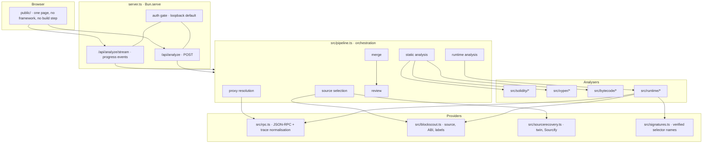

# 🏛️ Architecture

How the modules fit, what each stage promises, and how to extend the tool.

---

## 🧭 One picture



---

## 📦 Module responsibilities

| Module | Owns | Never does |
|---|---|---|
| `src/types.ts` | the shared vocabulary every module speaks | logic |
| `src/keccak.ts` | keccak256, pinned to published vectors | anything else |
| `src/abi.ts` | canonical signatures, selectors, standard detection, dispatcher scan | network access |
| `src/chains.ts` | the live-probed chain registry and the exclusion list | guesses about capability |
| `src/config.ts` | depth budgets, stage ceilings, key loading | chain facts |
| `src/rpc.ts` | JSON-RPC with budgets, trace normalisation, key scrubbing | aggregation |
| `src/blockscout.ts` | verified source, ABI, address summaries, candidate transactions | throwing |
| `src/signatures.ts` | selector to signature, verified by re-hashing | inventing a name |
| `src/labels.ts` | counterparty names inside a request budget | unbounded lookups |
| `src/sourcerecovery.ts` | twin and Sourcify recovery with a selector check | accepting an unverified match |
| `src/solidity/*` | Solidity structure and per-function evidence | trace data |
| `src/vyper/*` | the same for Vyper 0.2 to 0.4 | Solidity assumptions |
| `src/bytecode/*` | dispatcher shapes and a bounded CFG walk | source assumptions |
| `src/runtime/*` | discovery, trace trees, edge aggregation | source assumptions |
| `src/pipeline.ts` | orchestration, and the one place `possible` meets `observed` | provider details |
| `src/review.ts` | the evidence report | judgement about security |
| `server.ts` | transport, auth, progress streaming | analysis |
| `public/*` | rendering | analysis, fetch of anything but our API |

**The rule that keeps this clean:** only `src/pipeline.ts` knows about more than one
layer. Everything else answers one question with one shape.

---

## 🔤 The type contract

`src/types.ts` is the whole interface between stages. The important shapes:

```ts
FunctionAnalysis   // one exposed function: access, reads, writes, internal + possible calls
BytecodeFacts      // what a CFG walk proved about the compiled function
StaticAnalysis     // proxy, standards, functions, events, provenance, warnings
CallFrame          // the normalised trace frame, from either provider shape
OutboundEdge       // targetSelector → destination + destinationSelector + counts
InboundEdge        // caller + callerSelector → targetSelector + counts
TraceWindow        // span, slices, coveredBlocks, strategy, sampled, note
FunctionMap        // merged view: tree, narrative, externalCalls, observed, inbound
Review             // one check per claim the evidence supports or limits
AnalysisResult     // everything the page renders
```

Two separations are enforced by the types themselves, not by discipline:

- `StaticExternalCall` (a call site in code) and `OutboundEdge` (a frame in a trace) are
  different types. They meet only inside `MergedExternalCall`, which carries
  `possibleFromCode` and `observedOnchain` as separate booleans.
- `InboundEdge` and `OutboundEdge` never share a container.

---

## 🔄 Stage promises

| Stage | Promise | Degradation when a source fails |
|---|---|---|
| Proxy resolution | names the address whose code executes, and the method that found it | reports `detectedBy: none` |
| Source selection | prefers verified source at the address, then a recovered origin | falls back to ABI plus bytecode, and says so |
| Static analysis | every ABI function appears; no selector outside the ABI | a function with no source body is marked `hasSource: false` |
| Compiled walk | facts per dispatcher branch | a selector with no branch gets no facts, plus a warning |
| Runtime | edges only from real parent and child relations | `available: false` with a reason |
| Merge | `possible` and `observed` stay labelled | an unmatched edge is kept as observed only |
| Review | states what the evidence supports | names every refusal and every budget stop |

Nothing in the pipeline throws away a failure quietly. A failed lookup becomes a
warning, a review check, or both.

---

## ⏱️ Budgets, and why each exists

| Budget | Value | Reason |
|---|---|---|
| `STAGE_BUDGET_MS` | 60 / 120 / 240 s | one trace stage cannot run forever on a dense chain |
| `RpcClient.deadlineAt` | set by the stage | an in-flight request must not outlive the stage |
| call budget | 30 s per call, 20 s per attempt | retries otherwise multiply a stall into minutes |
| `maxFrames` | 4k / 12k / 30k | a busy address returns thousands of frames per 50 blocks |
| `maxTracedTxs` | 25 / 80 / 220 | each transaction is one trace request |
| `MAX_LABEL_LOOKUPS` | 60 | a busy token has hundreds of counterparties |
| `MAX_ABI_FETCHES` | 12 | the heavy explorer endpoint is what trips HTTP 429 |
| `MAX_CODE_PROBES` | 32 | a mass explorer refusal must not become hundreds of probes |

Every budget has one job: turn an unbounded wait into a smaller, **stated** result.

---

## 🧱 Invariants

These are worth a test each, because breaking them is invisible in the output.

1. A selector printed as a function of the target exists in the ABI, whenever an ABI
   exists.
2. An edge exists only where a parent and child relation exists in one call tree.
3. A `delegatecall` inside the identity set preserves the enclosing target function.
4. A `delegatecall` out of the identity set never enters `outbound.edges`.
5. `possibleFromCode` and `observedOnchain` are never derived from each other.
6. A signature from a database re-hashes to the selector it is printed against.
7. `TraceWindow.coveredBlocks` never exceeds `blocks`, and `slices` sum to it.
8. No error message that leaves the process contains the RPC key.

---

## 🧪 Testing strategy

| Layer | Approach |
|---|---|
| keccak and selectors | published vectors, plus an independent implementation for a multi-block message |
| signature verification | a real four byte collision, and a rejected candidate |
| trace aggregation | hand-built `CallFrame` trees, including a same-transaction pair that must produce no edge |
| Solidity and Vyper | committed fixtures per construct, then a real verified contract from mainnet |
| bytecode | hand-built dispatcher fixtures, then real contracts with known ABIs |
| pipeline | live smoke runs through `scripts/smoke.ts`, checked against known contracts |

A synthetic fixture cannot catch a semantics inversion, because the fixture inherits the
same mistake. Real bytecode caught the `GT` pivot bug. Keep both kinds.

---

## 🧩 How to extend

### Add a chain

1. Add the candidate to `scripts/probe-chains.ts` and run it.
2. Read the probe: block time, `trace_filter`, `debug_traceTransaction`, a working
   Blockscout v2 host, Sourcify support.
3. Add it to `src/chains.ts` only when `trace_filter` answers, or when
   `debug_traceTransaction` answers **and** an explorer can supply candidates.
4. Record a `probeNote` for anything surprising, and list an exclusion with its reason.
5. Prove it: `bun run scripts/smoke.ts <address> <chainKey> quick`.

### Add a source language

1. Create `src/<language>/index.ts` exporting the same shape as
   `src/solidity/index.ts`.
2. Reconcile against the ABI: adopt ABI signatures and selectors, drop what cannot be
   mapped, and warn.
3. Switch on `codeMeta.language` in `src/pipeline.ts`.
4. Prove it against a real verified contract, and list unresolved constructs.

### Add a dispatcher shape

1. Decode a real contract that uses it, and write the instruction sequence into a
   comment with the contract address and the compiler version.
2. Add the shape to `src/bytecode/dispatcher.ts`.
3. Keep the existing shapes untouched, and keep the honest fallback: no branch means no
   facts plus a warning.

### Add a view

1. The page reads `AnalysisResult` only. Add the field to `src/types.ts` first.
2. Render missing optional data as a plain explanation, never an empty box.
3. Use the six words. Do not invent a seventh.

---

## 🌐 HTTP surface

| Route | Method | Answer |
|---|---|---|
| `/` and `/public/*` | GET | the page and its assets, no token needed |
| `/api/chains` | GET | `{ chains, authRequired }` |
| `/api/analyze/stream` | GET | SSE: `progress`, then `result` or `error` |
| `/api/analyze` | POST | `AnalysisResult`, or `{ message }` with 400 or 401 |

Environment:

| Variable | Default | Effect |
|---|---|---|
| `ALCHEMY_API_KEY` | from `.env.local` | required |
| `PORT` | `8787` | listen port |
| `HOST` | `127.0.0.1` | any other value requires `AUTH_TOKEN` |
| `AUTH_TOKEN` | unset | when set, gates every `/api/` route |
