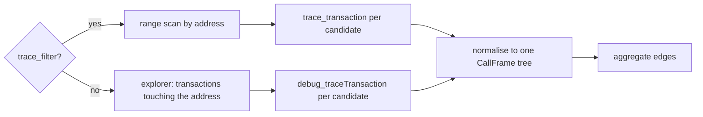

# 🎓 Concepts: how to map contract execution

This document teaches the techniques behind the tool. Read it if you want to build
something similar, or if you want to judge whether a screen tells you the truth.

| Section | Question it answers |
|---|---|
| [1. What a call frame is](#1-what-a-call-frame-is) | What does the chain actually record? |
| [2. Two shapes of trace](#2-two-shapes-of-trace) | Why do providers disagree? |
| [3. Rebuilding the tree](#3-rebuilding-the-tree-from-flat-frames) | How does `traceAddress` work? |
| [4. Attribution](#4-attribution-which-function-was-running) | Which target function caused this call? |
| [5. Proxies](#5-proxies-one-identity-two-addresses) | Why does a delegatecall break naive tools? |
| [6. Inbound callers](#6-inbound-callers-and-the-parent-frame) | Who called in, and from which function? |
| [7. Co-occurrence](#7-co-occurrence-is-not-causation) | Why is "same transaction" worthless? |
| [8. Selectors](#8-selectors-and-why-a-name-needs-proof) | How do four bytes become a name? |
| [9. Dispatchers](#9-dispatchers-in-compiled-code) | How do you read functions out of bytecode? |
| [10. Static against observed](#10-static-against-observed) | What may a code path claim? |
| [11. Sampling](#11-sampling-and-why-a-block-window-lies) | Why is "last 6000 blocks" misleading? |
| [12. Source recovery](#12-source-recovery) | What if the address is unverified? |

---

## 1. What a call frame is

The EVM executes a tree of calls. One transaction starts with a single frame, and every
`CALL`, `STATICCALL`, `DELEGATECALL`, `CREATE`, or `SELFDESTRUCT` opens a child frame.

A frame carries the facts an execution map needs:

```ts
{
  from:     "0xrouter…",    // who runs the code that made this call
  to:       "0xvault…",     // who receives it
  input:    "0x6e553f65…",  // first 4 bytes = the function selector
  callType: "call",         // call | staticcall | delegatecall | create | …
  value:    "0x0",
  children: [ /* frames this frame opened */ ]
}
```

Two facts matter more than the rest:

- The **first four bytes of `input`** name the function being invoked.
- The **parent and child relation** proves who called whom. Nothing else does.

---

## 2. Two shapes of trace

Providers answer trace questions in two incompatible shapes, and a portable tool must
speak both.

### Flat frames: `trace_filter` and `trace_transaction`

The OpenEthereum family returns a **flat list**. Each entry carries a `traceAddress`
path that says where it sits in the tree.

```json
[
  { "traceAddress": [],      "action": { "from": "0xrouter", "to": "0xvault", "input": "0x6e553f65…" } },
  { "traceAddress": [0],     "action": { "from": "0xvault",  "to": "0xusdc",  "input": "0x23b872dd…" } },
  { "traceAddress": [1],     "action": { "from": "0xvault",  "to": "0xmorpho","input": "0xa99aad89…" } },
  { "traceAddress": [1, 0],  "action": { "from": "0xmorpho", "to": "0xirm",   "input": "0x8c00bf6b…" } }
]
```

`trace_filter` is the powerful one: it searches a **block range** by address, in one
request, with `after` and `count` paging.

```jsonc
// every frame that entered the target in a range
{ "fromBlock": "0x…", "toBlock": "0x…", "toAddress": ["0xvault"], "after": 0, "count": 500 }
// every frame the target made
{ "fromBlock": "0x…", "toBlock": "0x…", "fromAddress": ["0xvault"] }
```

### Nested frames: `debug_traceTransaction` with `callTracer`

The Geth family returns the **tree directly**, one transaction at a time.

```json
{ "from": "0xrouter", "to": "0xvault", "input": "0x6e553f65…",
  "calls": [ { "from": "0xvault", "to": "0xusdc", "input": "0x23b872dd…" } ] }
```

### What we measured

| Chain family | `trace_filter` | `debug_traceTransaction` |
|---|---|---|
| Ethereum, Base, Optimism, and most OP-stack chains | ✅ | ✅ |
| Arbitrum One | ❌ *"not available on the ARB_MAINNET"* | ✅ |
| Polygon | ❌ *"not supported after the Erigon to Bor migration"* | ✅ |

**Design consequence.** `trace_filter` finds candidates cheaply across a range, but it
does not exist everywhere. `debug_traceTransaction` exists nearly everywhere, but it
needs a transaction hash first. So a portable tool needs two discovery paths and one
aggregation path:



Normalise early. Aggregation code that branches on the provider becomes wrong twice.

---

## 3. Rebuilding the tree from flat frames

`traceAddress` is the path from the root: `[]` is the transaction level frame, `[0]` its
first child, `[1, 0]` the first child of its second child.

```text
[]        deposit()            router → vault
├── [0]   transferFrom()       vault  → USDC
└── [1]   supply()             vault  → Morpho
    └── [1,0] borrowRateView() Morpho → IRM
```

The algorithm is short, and the sort is the part people get wrong:

1. Sort by path **length first**, then element by element. A parent then always exists
   before its children.
2. Index each frame by its joined path.
3. Attach each frame to the frame at `path.slice(0, -1)`.
4. Keep an orphan rather than dropping it, and say so, because a provider can truncate.

---

## 4. Attribution: which function was running?

An outbound edge is only useful when you know **which target function caused it**.
`Vault → Morpho.supply()` is trivia. `Vault.deposit() → Morpho.supply()` is the map.

Walk the tree once and carry a variable: *the selector of the target function currently
executing*.

```text
frame: router → vault   input 0x6e553f65   ⇒ enclosing = deposit()
  frame: vault → USDC   input 0x23b872dd   ⇒ edge: deposit() → USDC.transferFrom()
  frame: vault → morpho input 0xa99aad89   ⇒ edge: deposit() → Morpho.supply()
    frame: morpho → irm                    ⇒ not ours: neither side is the target
```

Rules that keep this correct:

- Set the enclosing selector when a frame **enters** the target.
- Do **not** reset it on frames that do not touch the target.
- When no enclosing function is known, mark the edge `unattributed`. Never guess.

---

## 5. Proxies: one identity, two addresses

A proxy makes the naive version wrong. The trace looks like this:

```text
router → proxy          call          deposit()          ← user's intent
  proxy → implementation delegatecall deposit()          ← same storage, same context
    proxy → USDC         call          transferFrom()     ← note the `from`
```

Two traps:

1. The `delegatecall` frame is **not** a new target function. It is the same call,
   continuing in the implementation's code. Resetting the enclosing selector there loses
   the attribution.
2. Outbound calls appear with `from = proxy`, because `delegatecall` keeps the caller
   identity. A tool that only knows the implementation address sees nothing.

**Solution: an identity set.** Treat `{proxy, implementation}` as one contract.

- `to ∈ identity` and `from ∉ identity` → **inbound**.
- `from ∈ identity` and `to ∉ identity` → **outbound**.
- Both in the identity set → internal plumbing, no edge, and the enclosing selector
  survives.
- A `delegatecall` **out of** the identity set is reported separately, because it runs
  foreign code against your storage. That is a different risk from an ordinary call.

Finding the implementation is its own small craft:

| Method | Where to look |
|---|---|
| EIP-1967 | storage slot `keccak256("eip1967.proxy.implementation") - 1` |
| EIP-1967 beacon | beacon slot, then call `implementation()` on the beacon |
| EIP-1822 | storage slot `keccak256("PROXIABLE")` |
| Getter | `eth_call` of `implementation()` |
| Explorer | the verified `proxy_type` and `implementations` fields |

Accept a candidate only when code lives at it, and record **which method answered**.

---

## 6. Inbound callers and the parent frame

For an inbound edge, the caller function is the selector of the **parent frame**:

```text
[]     EOA    → allocator  input 0x7d7c2a1c   ⇒ caller function = rebalance()
└─[0]  allocator → vault    input 0x7299aa31   ⇒ inbound edge:
                                                 Allocator.rebalance() → Vault.reallocate()
```

Three cases, three honest answers:

| Situation | What to print |
|---|---|
| Parent frame exists with readable calldata | `Caller.function() → Target.function()` |
| Frame is transaction level, sender has no code | `externally owned account → Target.function()` |
| Parent exists but calldata is unreadable | `Unknown caller function → Target.function()` |

Never invent the third case into the first. An analyst who sees a fabricated caller name
draws a false conclusion about who controls the contract.

---

## 7. Co-occurrence is not causation

The tempting shortcut: collect every address in transactions that touched the target,
and call them related. It produces a graph that looks rich and means nothing.

```text
Transaction 0xabc…
  frame []      EOA      → router
  frame [0]     router   → vault      ← vault really was called by router
  frame [1]     router   → aggregator ← aggregator NEVER touched the vault
```

A tool that reads "same transaction" reports `aggregator → vault`. It never happened.
**Only a direct parent and child relation creates an edge.** Write it as an invariant,
and put a test on it, because the shortcut is easy to reintroduce.

---

## 8. Selectors, and why a name needs proof

A function selector is the first four bytes of `keccak256` over the **canonical**
signature:

```text
keccak256("transfer(address,uint256)")[0:4] = 0xa9059cbb
```

Canonical means the ABI type, not the type as written in source:

| Written in source | Canonical | Why |
|---|---|---|
| `MarketParams` (struct) | `(address,address,address,address,uint256)` | structs expand to tuples, recursively |
| `MarketAllocation[]` | `((address,…,uint256),uint256)[]` | arrays keep the suffix |
| `Id` (`type Id is bytes32`) | `bytes32` | user defined value types use the underlying type |
| `Side` (enum) | `uint8` | enums are `uint8` |
| `IERC20` (contract type) | `address` | contract types are addresses |

Hashing the source spelling produces a selector that **does not exist on chain**. In
this project that bug produced a phantom `acceptCap(MarketParams)` with selector
`0xc56fbbbc` next to the real `acceptCap((address,address,address,address,uint256))`
`0x6fda3868`, and it split the static call sites away from the observed calls. The fix
has two parts: canonicalise types, then treat the ABI as ground truth and drop any
selector the ABI does not contain.

### Reverse lookup needs verification

For selectors with no ABI, signature databases help. They are also full of noise:
selectors collide, and anyone can submit an entry.

```text
0xa9059cbb → ["transfer(address,uint256)", "many_msg_babbage(bytes1)", …]
```

Rule: **re-hash every candidate and keep only exact matches**, prefer the shortest
survivor, and record the alternatives so the interface can warn about ambiguity. A name
you did not verify is a guess wearing a monospace font.

---

## 9. Dispatchers in compiled code

Without source you can still learn a lot, because a contract must dispatch on the
selector, and the compiler emits a recognisable shape.

### solc, linear form

```text
PUSH4 0xa9059cbb
EQ
PUSH2 <destination>
JUMPI              ← equal? jump to the function body
```

### solc, binary search form

Once a contract serves many functions, solc emits a search over sorted selectors:

```text
DUP1
PUSH4 <pivot>
GT                 ← careful: this computes  pivot > selector
PUSH2 <destination>
JUMPI
```

The operand order is a real trap. Reading it backwards resolves the wrong half of the
tree and silently attributes facts to the wrong functions.

### Vyper

Vyper does not use the solc shape. Three shapes appear in the wild:

| Shape | Sequence | Seen on |
|---|---|---|
| reload | `PUSH4 sel; PUSH 0; MLOAD; EQ; ISZERO; PUSH dest; JUMPI` | Curve 3pool, Vyper 0.2 |
| reuse | `PUSH4 sel; DUP2; EQ; ISZERO; PUSH dest; JUMPI` | Yearn V2 vault, Vyper 0.3 |
| venom | `PUSH4 sel; DUP2; XOR; PUSH dest; JUMPI` | Vyper 0.4 |

Note the inversion: a **match falls through** and a mismatch jumps.

### Two further details

- **Do not scan for `PUSH4` alone.** Custom error codes are also four bytes. Only a push
  that feeds a comparison is a dispatcher entry. That single rule took a scan from 30
  noisy candidates down to 8 real ones, and it reproduces verified ABIs exactly: 73 of
  73 on one contract, 55 of 55 on another, with zero extras.
- **Strip the metadata trailer.** solc appends CBOR metadata whose final two bytes hold
  its length. Decoding it as instructions produces nonsense.

### Walking a function body

From the dispatcher branch, walk basic blocks with a visited set and a block cap, and
collect what the opcodes prove: `SLOAD`, `SSTORE`, `CALL`, `STATICCALL`, `DELEGATECALL`,
`CREATE`, `SELFDESTRUCT`, `PUSH20` address constants, `LOG` topics.

A naive walker stops at the first internal call, because compilers pass return addresses
through the stack rather than as a literal push. A small **abstract stack interpreter**,
which tracks only values it can prove came from a push, resolves those jumps and reaches
the real body. Whatever you build, report the stop:

> A fact of `no` means "not seen on the walked paths", never "cannot happen".

---

## 10. Static against observed

Source analysis answers *what can happen*. Traces answer *what did happen in the window
I looked at*. They are different truths and they must never be merged into one number.

|  | Source analysis | Transaction traces |
|---|---|---|
| Coverage | every branch, including branches never taken | only executed paths |
| Blind spots | dynamic destinations, assembly, `raw_call` | anything not called in the window |
| Needs | verified source | an archive node with traces |
| Answers | "possible from code" | "observed onchain" |

Keep both, label both, and let them cross-check each other:

- **Possible, not observed** → a real code path with no traffic in the window. Show it
  dashed. It is a capability, not an event.
- **Observed, not possible** → a call in traces with no matching call site. That is a
  finding, not an error: dynamic dispatch, inline assembly, or partial source.
- **Both** → the strongest statement the tool can make about one path.

---

## 11. Sampling, and why a block window lies

"The last 6,000 blocks" means twenty hours on Ethereum and three hours on Base. The same
number describes different questions on different chains, so ask for **time** instead,
then convert with the chain's block time.

A dense chain still cannot answer a whole span inside a time budget. Two ways to cut it:

```text
❌ contiguous tail          ✅ stratified slices
[####                ]     [##      ##      ##      ##]
last few minutes only      spread across the whole span
```

The contiguous tail is biased towards whatever happened in the last minutes, which is
exactly when a bot may be spamming. Stratified slices describe the span. Either way, the
interface must state four things:

1. the span you aimed at,
2. the blocks you really read,
3. the transactions you traced against the transactions you found,
4. the reason the scan stopped.

```text
Read 4 slices of about 333 blocks spread over the last 1.0 days.
The slices cover 1332 of 43200 blocks, about 44 minutes.
The frame cap for depth "quick" stopped the scan.
Counts describe this sample, not lifetime totals.
```

Never extrapolate a sample into a lifetime total. A reader who screenshots
`12,441 calls` will quote it forever.

---

## 12. Source recovery

An unverified address often has verified code somewhere else, because clones and factory
deployments share runtime code.

| Origin | How to find it |
|---|---|
| Verified bytecode twin | the explorer reports it as `verified_twin_address_hash` |
| Sourcify | `https://sourcify.dev/server/v2/contract/{chainId}/{address}` |

Two practical notes from building this:

- The legacy Sourcify layout `repo.sourcify.dev/contracts/full_match/…` now redirects and
  answers 404 even for verified addresses. Use the v2 API, which reports the match level
  as `exact_match` or `match`.
- Sourcify keys on the **EIP-55 checksummed** address. Implement the checksum with
  keccak256; a lowercase address returns nothing.

**Verify before you trust.** Scan the dispatcher selectors of the code at the analysed
address, and accept the recovered ABI only when a large majority of them appear in it.
Two thirds is a reasonable bar. Then state the origin in the interface:

> Source from the Sourcify repository, partial match, chain 1. The metadata hash differs
> from the recompiled bytecode.

A partial match means the source compiles to the same code but the metadata differs.
That is usually a comment or a path difference. Say it, and let the reader judge.

---

## 📌 Summary: eleven rules worth keeping

1. Normalise every provider shape into one call frame tree.
2. Sort flat frames by `traceAddress` depth before rebuilding.
3. Carry the enclosing target function while you walk.
4. Treat proxy and implementation as one identity.
5. Report a delegatecall out of that identity separately.
6. Take the caller function from the parent frame, or say it is unknown.
7. Never create an edge from co-occurrence.
8. Canonicalise types before you hash a signature.
9. Re-hash every database signature before you print it.
10. Keep `possible` and `observed` in separate fields.
11. State the span, the coverage, and the stop reason on every screen.
